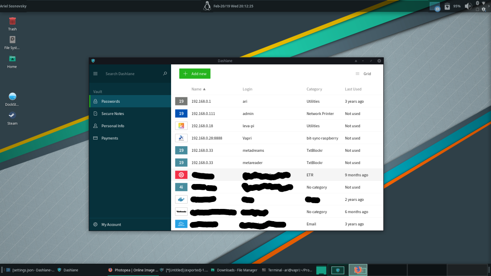

# Dashlane Linux GUI Application

This is a simple tweak that uses [Jade-Application-Kit](https://github.com/codesardine/Jade-Application-Kit) to install a windowed-web application of the Dashlane Password manager.

## Installation

- make sure that you have [Jade-Application-Kit](https://github.com/codesardine/Jade-Application-Kit) (note that this should be pre-installed on your system)
- run the following commands

```
wget https://raw.githubusercontent.com/asosnovsky/dashlane-jad-gui/master/install;sh ./install
```

## Screenshots



